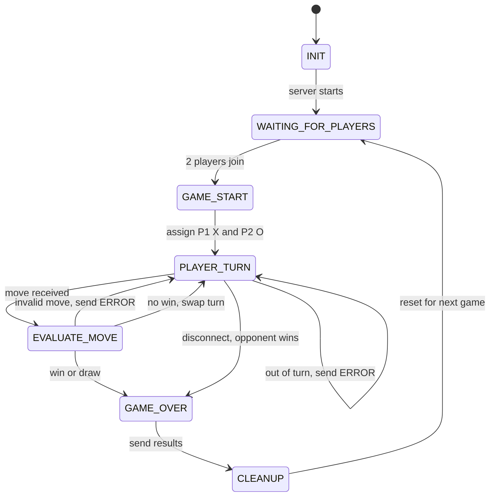

# Connect 4 FSM

## States
- INIT: server starts
- WAITING_FOR_PLAYERS: waits for 2 players to connect
- GAME_START: assigns Player 1 X and Player 2 O
- PLAYER_TURN: waits for the current player's move
- EVALUATE_MOVE: checks the move, places the piece, checks for a win or draw
- GAME_OVER: sends the result to both players
- CLEANUP: closes sockets and resets the board